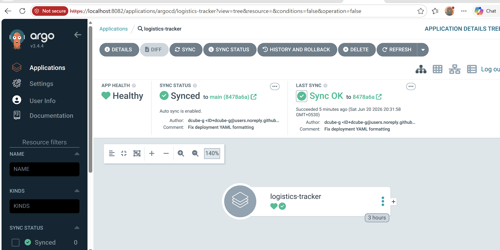
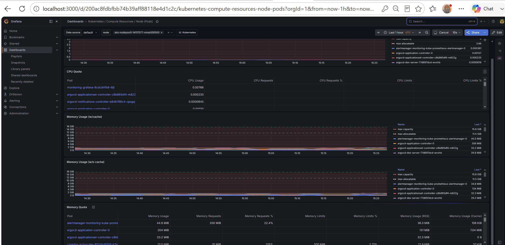
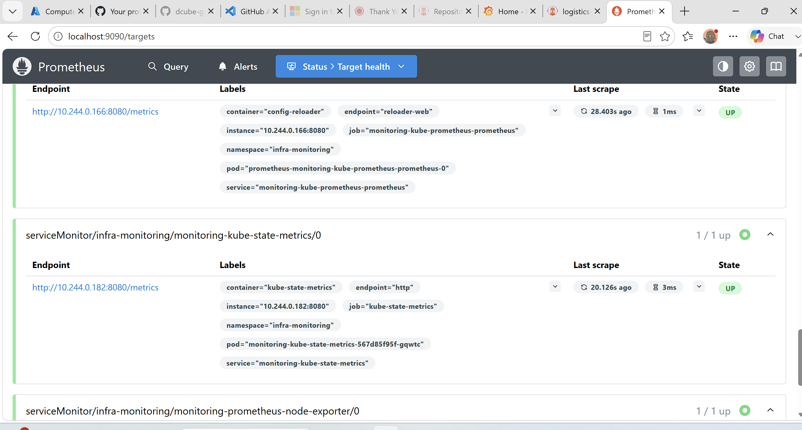
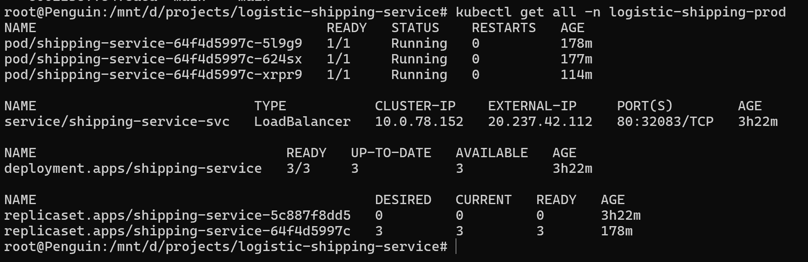
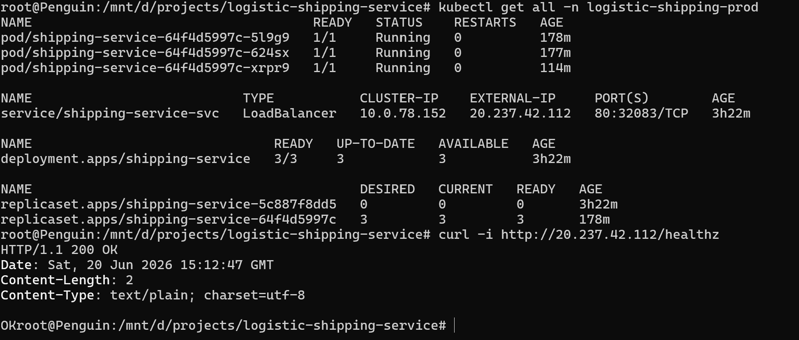
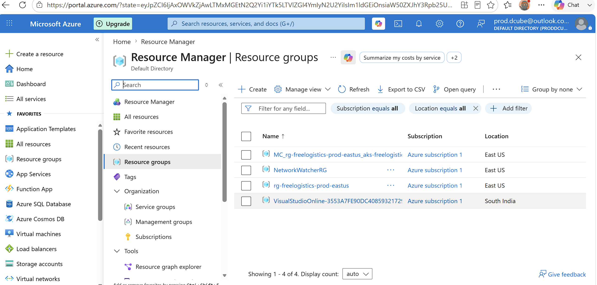
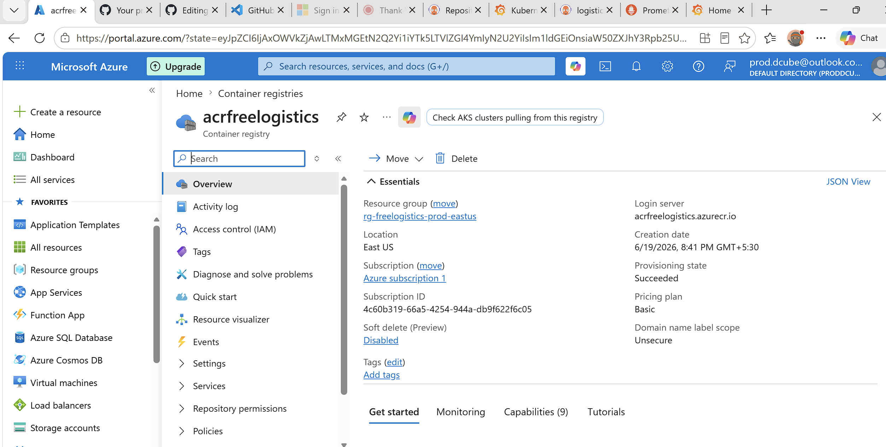

# Cloud-Native Logistics Dispatch Tracker

### 📊 Project Context
*   **Architecture Strategy:** GitOps Continuous Delivery & Infrastructure Observability
*   **Target Environment:** 100% Azure Free Tier & GitHub Open-Source Automation
*   **CD Model:** Pull-based GitOps (Argo CD)
*   **Monitoring Stack:** Prometheus Node Exporter DaemonSet

---

## 1. Project Abstract
Modern cloud architectures require robust, automated continuous delivery systems and real-time infrastructure visibility. However, enterprise deployment engines like Spinnaker often introduce prohibitive computing overheads and cost barriers for small teams or experimental sandbox environments.

This project delivers a production-grade, highly automated **Logistics Dispatch Tracker Microservice Architecture** designed to run entirely within the **100% Free Tiers** of GitHub and Azure Cloud. By replacing legacy, resource-heavy CD engines with a modern, pull-based GitOps platform (**Argo CD**), the entire ecosystem is optimized to operate on minimalist, burstable cloud infrastructure without generating usage fees.

### Core Technical Implementation Highlights
*   **Secure Cloud-Native Automation (CI):** Implements **GitHub Actions** workflows utilizing **OpenID Connect (OIDC)** federated credentials. This architecture completely eliminates the security risk of storing long-lived, permanent cloud passwords or service principal secrets within the source code repository.
*   **Declarative GitOps Infrastructure (CD):** Leverages **Argo CD** to enforce a pure GitOps model. The production state of the **Azure Kubernetes Service (AKS)** cluster is entirely synchronized with declarative YAML manifests stored in a secure GitHub repository, creating a self-healing infrastructure layer.
*   **Infrastructure Observability:** Provisions a distributed **Prometheus Node Exporter** framework across the managed cluster. This system tracks real-time node performance, memory allocation, and CPU credit depletion on low-cost, burstable cloud computing hardware.
*   **FinOps & Resource Optimization:** Enforces strict hardware boundaries, optimized Docker multi-stage compilation patterns, and specialized Kubernetes resource constraints (`limits` and `requests`) to prevent container memory eviction and avoid cloud billing overages.

---

## 2. Compliant Enterprise Naming Conventions

| Cloud Resource | Enterprise Standard Taxonomy Name |
| :--- | :--- |
| **Resource Group** | `rg-freelogistics-prod-eastus` |
| **AKS Cluster** | `aks-freelogistics-prod-01` |
| **Container Registry** | `acrfreelogistics` *(Alphanumeric only)* |
| **Virtual Network** | `vnet-freelogistics-prod-eastus` |
| **Kubernetes Namespace (App)** | `logistic-shipping-prod` |
| **Kubernetes Namespace (CD)** | `argocd` |
| **Kubernetes Namespace (Metrics)**| `infra-monitoring` |

---

## 3. Infrastructure Provisioning Script (Azure CLI)

Execute the following commands in your terminal initialized with the Azure CLI toolset to create the cloud fabric:

```bash
# 1. Create the dedicated Resource Group
az group create --name rg-freelogistics-prod-eastus --location eastus

# 2. Provision the Basic Container Registry (Free tier compliant storage limits)
az acr create --resource-group rg-freelogistics-prod-eastus --name acrfreelogistics --sku Basic

# 3. Deploy the AKS Cluster using Free Tier settings and Free-eligible VM profiles
az aks create \
  --resource-group rg-freelogistics-prod-eastus \
  --name aks-freelogistics-prod-01 \
  --tier free \
  --node-count 2 \
  --node-vm-size Standard_B2ats_v2 \
  --attach-acr acrfreelogistics \
  --enable-managed-identity

# 4. Connect local kubectl tool to the new Azure cluster context
az aks get-credentials --resource-group rg-freelogistics-prod-eastus --name aks-freelogistics-prod-01
```

---

## 4. Continuous Integration Workflow (GitHub Actions)

Save this configuration inside your repository at: `/.github/workflows/deploy-prod.yml`

---

## 5. Declarative Kubernetes Manifest

Save this template inside your repository folder at: `/.k8s/deployment.yaml`

---

## 6. Operational Steps & Verification

### Argo CD Engine Initialization
```bash
kubectl create namespace argocd
kubectl apply -n argocd -f https://githubusercontent.com
```

### Prometheus Node Exporter Setup
```bash
kubectl create namespace infra-monitoring
helm repo add prometheus-community https://github.io
helm repo update
helm install node-exporter prometheus-community/prometheus-node-exporter --namespace infra-monitoring --set fullnameOverride=node-exporter
```

### Verification
```bash
# Get Argo CD admin password
kubectl -n argocd get secret argocd-initial-admin-secret -o jsonpath="{.data.password}" | base64 --decode; echo

# Access Argo CD Web UI locally
kubectl port-forward svc/argocd-server -n argocd 8080:443
```

---

## 7. Troubleshooting Handbook

#### Error 1: Azure OIDC Authentication Failure (`OIDC: Failed to fetch token`)
*   **The Cause:** The federated credential configuration in Microsoft Entra ID does not precisely match the GitHub context string.
*   **The Fix:** Ensure your target subject exactly reads: `repo:your-github-org/logistic-shipping-service:ref:refs/heads/main`.

#### Error 2: Container Image Pull Failure (`ImagePullBackOff`)
*   **The Cause:** AKS lacks RBAC access to ACR, or the manifest tag is mismatched.
*   **The Fix:** Run `az aks update --resource-group rg-freelogistics-prod-eastus --name aks-freelogistics-prod-01 --attach-acr acrfreelogistics` to fix permissions.

#### Error 3: Pod Memory Eviction (`OOMKilled`)
*   **The Cause:** Your `Standard_B2ats_v2` burstable virtual machines have run out of memory.
*   **The Fix:** Lower your container resource limits in `deployment.yaml` or drop the Argo CD web dashboard by migrating to an **Argo CD Core** configuration.

# Screenshots & Validation

## Argo CD Synchronization

Shows the GitOps application status with Healthy and Synced state.



---

## Grafana Infrastructure Dashboard

Node CPU, memory, filesystem, and network metrics collected via Prometheus Node Exporter.



---

## Prometheus Targets

Prometheus successfully scraping node-exporter metrics.



---

## Kubernetes Workloads

Application deployment, pods, services, and ReplicaSets running in AKS.


---

## Application Health Check

Health endpoint verification returning HTTP 200 OK.



---

# Azure Infrastructure

## Azure Kubernetes Service


---
## Azure Resource Group



---

## Azure Container Registry


